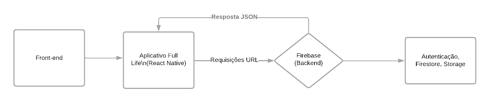
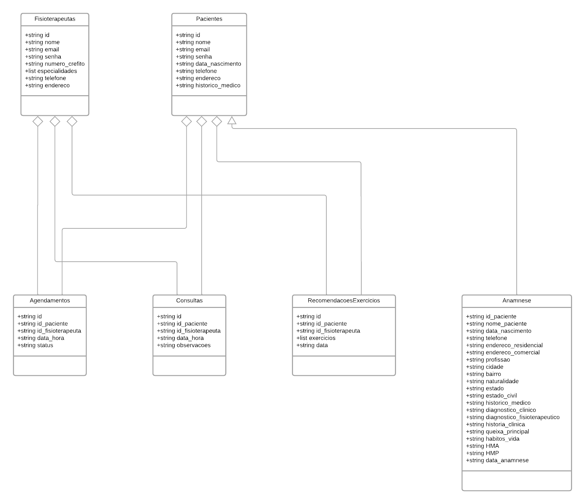

# Arquitetura da Solução

## Diagrama de Classes

## Modelo Físico

## Tecnologias Utilizadas
Para o desenvolvimento da aplicação móvel, utilizaremos as seguintes tecnologias:

### 1. **React Native**
Será a base para o desenvolvimento de uma aplicação *cross-platform*, funcionando em Android e iOS com um único código JavaScript.

### 2. **React**
Usaremos React para a construção da interface de usuário, garantindo modularidade e reutilização de componentes.

### 3. **Firebase**
Será o *back-end*, fornecendo autenticação, banco de dados em tempo real e notificações *push*, facilitando o gerenciamento de dados.

### 4. **Visual Studio Code**
IDE utilizada para o desenvolvimento, com suporte a extensões que otimizam o trabalho com React Native.

### 5. **Node.js e NPM**
Para gerenciar o ambiente e instalar dependências como React Navigation e Axios.

### 6. **Expo**
Facilitará o teste e deploy do app, tornando o processo mais ágil.

### 7. **Git e GitHub**
Para controle de versão e colaboração.

### 8. **Redux (ou Context API)**
Gerenciará o estado global da aplicação, garantindo dados consistentes.

Este conjunto de ferramentas e serviços garante um desenvolvimento ágil, com foco em performance e escalabilidade.

### Explicação: 
A interação do usuário com a aplicação ocorre via React Native, que renderiza a interface. A aplicação usa Redux (ou Context API) para gerenciar o estado global. Quando uma ação exige dados do back-end, ela faz uma requisição ao Firebase, que cuida da autenticação, armazenamento e notificações em tempo real. O front-end, utilizando bibliotecas como Axios, recebe a resposta, atualiza o estado e a interface, garantindo uma experiência fluida. Expo facilita testes e deploy, enquanto Git/GitHub assegura controle de versão e colaboração contínua.

## Qualidade de Software
 ### 1. Funcionalidade (Adequação Funcional)
    
a) Completude Funcional: O software deve cobrir todas as funcionalidades necessárias, como agendamento, visualização de horários, cancelamento e histórico de consultas.
* Métrica: Percentual de funcionalidades entregues com relação às planejadas (ex.: 90% das funcionalidades planejadas devem estar implementadas).
  
b) Correção Funcional: As funcionalidades implementadas devem cumprir com os requisitos e funcionar conforme o esperado.
* Métrica: Taxa de defeitos encontrados por funcionalidade ou por módulo (ex.: quantidade de bugs por função).
  
### 2. Confiabilidade
   
a) Tolerância a Falhas: O sistema deve continuar funcionando mesmo em caso de falhas menores, como falha na conexão de rede durante um agendamento.
* Métrica: Percentual de tempo de inatividade tolerado durante o uso (ex.: 99,5% de disponibilidade).
  
b) Maturidade: O número de falhas do sistema deve ser minimizado conforme o sistema amadurece.
* Métrica: Número médio de falhas por módulo por release.
  
### 3. Usabilidade
a) Apreensibilidade: Facilidade com que os usuários (pacientes e fisioterapeutas) conseguem aprender a usar o sistema, especialmente nas funcionalidades principais.
* Métrica: Tempo médio para um novo usuário realizar uma ação-chave (ex.: agendar uma consulta).
  
b) Operabilidade: O sistema deve ser fácil de operar, permitindo que os usuários executem suas tarefas de forma eficiente.
* Métrica: Percentual de usuários que conseguem completar uma tarefa sem assistência (ex.: 90% dos usuários completam o agendamento de consulta na primeira tentativa).

### 4. Desempenho
a) Tempo de resposta: A aplicação deve responder rapidamente às interações do usuário, como ao carregar uma agenda de horários.
* Métrica: Tempo médio de resposta de operações críticas (ex.: menos de 2 segundos para carregar os horários disponíveis).
  
b) Capacidade: O sistema deve ser capaz de lidar com uma quantidade crescente de usuários sem perda significativa de desempenho.
* Métrica: Número máximo de usuários simultâneos suportados sem queda de desempenho.

### 5. Segurança
a) Confidencialidade: As informações sensíveis, como dados médicos e pessoais, devem ser protegidas contra acessos não autorizados.
* Métrica: Percentual de tentativas de acesso bloqueadas com sucesso (ex.: 100% das tentativas não autorizadas são bloqueadas).

### 6. Manutenibilidade
a) Modularidade: O código do sistema deve ser modular, facilitando modificações e atualizações em áreas específicas.
* Métrica: Tamanho médio dos módulos ou classes e sua independência funcional (medido por acoplamento e coesão).
  
b) Facilidade de análise: A capacidade de diagnosticar e corrigir problemas ou realizar melhorias deve ser ágil.
* Métrica: Tempo médio para localizar e corrigir um defeito (ex.: tempo médio de correção de bugs).

### Justificativa das Subcaracterísticas Escolhidas

- Tempo e recursos limitados: A escolha de subcaracterísticas priorizou aspectos essenciais para um software de agendamento, como funcionalidade correta, desempenho adequado, segurança e facilidade de uso, aspectos críticos para qualquer software que lida com dados sensíveis e possui uma base de usuários ampla.

- Qualidade percebida pelo usuário: Usabilidade e desempenho são fundamentais para garantir uma boa experiência de uso. Já segurança é imprescindível para proteção de dados pessoais.

- Facilidade de manutenção: Subcaracterísticas de manutenibilidade ajudam a manter o software atualizado, corrigir problemas rapidamente e adicionar novas funcionalidades conforme o sistema evolui.
